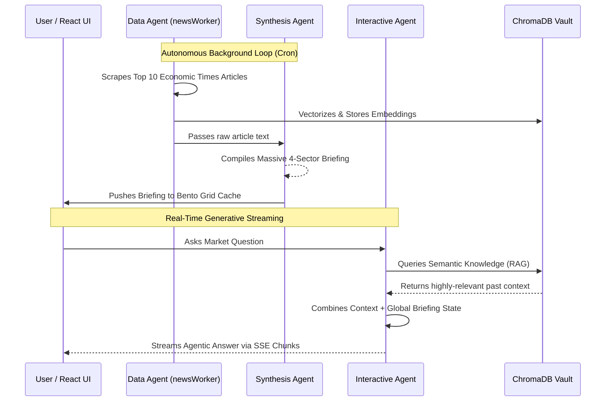

# 🌐 ET News Navigator: Agentic AI Intelligence Dashboard

An enterprise-grade, real-time financial intelligence platform powered by an autonomous Agentic AI architecture. `ET News Navigator` continuously scrapes global market data from The Economic Times and synthesizes it into a high-fidelity Briefing Dashboard and RAG-augmented Interactive Chat.

---

## 🚀 Tech Stack
*   **Frontend**: React.js, Tailwind CSS v4 (Glassmorphism), Vite
*   **Backend**: Node.js, Express.js
*   **AI Engines**: Google Gemini API (`text-embedding-004`, `gemini-3-flash-preview`)
*   **Vector Database**: ChromaDB (RAG)
*   **Security & Data**: JWT (JSON Web Tokens), `node-cron`, `rss-parser`, `cheerio`, `portfinder`

---

## ⚡ Core Features
*   **Agentic Pipeline**: Three specialized AI agents autonomously scrape, synthesize, and converse about live market data.
*   **Triple Core Bento Grid**: A gorgeous, responsive, atmospheric Glassmorphism dashboard running entirely on Markdown parsers.
*   **Asynchronous Semantic Cache**: A `node-cron` daemon continuously vectorizes news into Chroma DB in the background for zero-latency UI reloads.
*   **Secure Authentication**: Fully locked down by HTTP-only JSON Web Tokens (JWT) and a premium Lock Screen sequence.
*   **Unkillable Architecture**: Dynamic `portfinder` sweeps, and seamless mock data failovers designed for massive resilience during live demos.

---

## 🧠 System Architecture



---

## ⚙️ Setup & Deployment

1. **Clone & Install Dependencies**
   ```bash
   git clone https://github.com/coderaj2006/ET_News_Navigator.git
   cd ET_News_Navigator
   
   # Install Backend
   cd server && npm install
   
   # Install Frontend
   cd ../client && npm install
   ```

2. **Environment Configuration**
   Create a `.env` in the `server` directory:
   ```env
   GEMINI_API_KEY=your_google_gemini_api_key_here
   JWT_SECRET=your_hyper_secure_secret
   # USE_MOCK=true # (Uncomment to bypass internet & API scraping)
   ```

3. **Boot Sequence**
   You will need two terminals running simultaneously:
   ```bash
   # Terminal 1: Backend
   cd server
   node index.js
   
   # Terminal 2: Frontend
   cd client
   npm start
   ```

---

## 🛠️ Troubleshooting & Resilience Strategies

### 1. The Dynamic Port Scanner (`portfinder`)
**Behavior/Issue:** During high-intensity development, Node processes (like `:5001`) often get orphaned or locked by the system resulting in `EADDRINUSE` fatal crashes for standard applications.

**Resolution:** This architecture is equipped with `portfinder`. If port `5001` is already locked by a rogue process, the Express backend will automatically deploy to `5002` (or sequentially upward). The React frontend's `getBackendUrl()` hook natively ping-sweeps your local network (`HEAD` request) and will dynamically lock the frontend onto the newly migrated port completely silently.

### 2. High-Fidelity 429 Mock Failsafe
**Behavior/Issue:** Google Gemini throttles API requests with extremely aggressive `429 Quota Exhausted` limits, which would traditionally tear down a live Hackathon demonstration.

**Resolution:** If the backend triggers an API quota limit during heavy synthesis, the `Synthesis Agent` will *not* crash. It natively intercepts the `429` error inside `generateContent()` and instantaneously injects a pre-written, highly-detailed **Mock Intelligence Briefing** into the UI so the dashboard remains beautifully populated and completely functional while you wait for your API keys to cool down.

---

## 🤝 Team & Contributions

This project was engineered for a high-intensity Hackathon by a dedicated team pushing the frontier of Agentic workflows:
- **Lead Architect / Backend Engineer**: [Your Name/Role]
- **Frontend / UI Design**: [Your Name/Role]
- **AI / Pipeline Engineer**: [Your Name/Role]

*Code submissions requires prior approval on the `main` branch.*